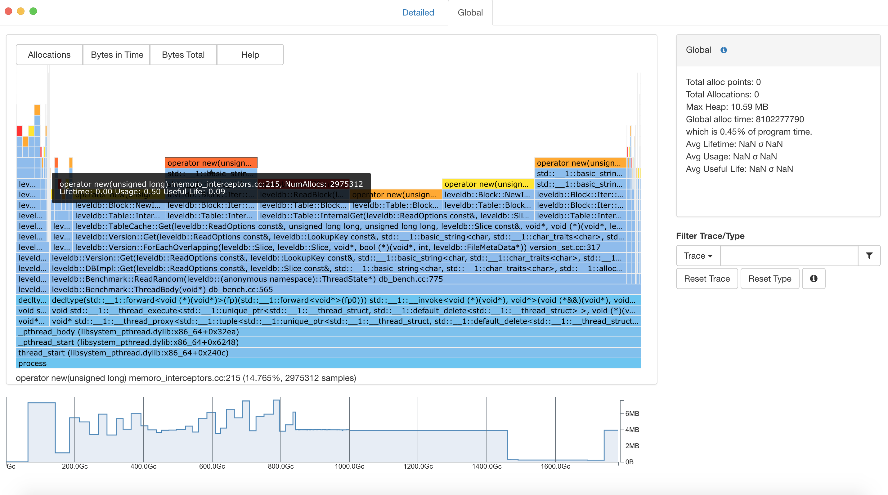

# Using Memoro - Runtime Library

This page will explain how to use memoro once it is set-up. If you have not set-up Memoro yet, refer to [here](set_up.md).

## Memoro with a simple program

The general steps with using Memoro on a simple file (e.g. `test.cpp`) are shown below. 

```bash
1. <path to llvm clone>/bin/clang++ -fsanitize=memoro -g -fno-omit-frame-pointer test.cpp
2. ./a.out
```

You need to pass in a flag `-fsanitize=memoro` for Memoro to work. The omitting of frame-pointers and debug mode flags are optional but recommended for Memoro to give you line numbers and better stack traces. 

Once you run this, you should be able to see these items appear:
1. A folder called `typefiles` - Memoro stores type information here
2. *.chunks / *.trace files - use this together with the visualizer to analyse your application

**Note**: If your compiler cannot find the relevant c++ header files, you may need to include their path manually. (e.g on a OSX system, it is:
 `-I /Applications/Xcode.app/Contents/Developer/Toolchains/XcodeDefault.xctoolchain/usr/include/c++/v1`)

## Memoro on a larger application

Now that we have tried Memoro with a simple program, it is important to consider how Memoro works with a larger application. After all, the true strength of Memoro is using it to debug large C++ applications and identify areas where memory management can be improved upon. 

For this guide, we will try to analyse [LevelDB](https://github.com/google/leveldb). LevelDB is a open-source fast key-value storage library written at Google. The main steps to do this are as follows:

1. Update build system to add in the abovementioned flags. C/C++ applications use build systems (CMake/AutoConf etc.) We have to trace this file and add in the flags needed for Memoro. CMake is the most popular at the moment and LevelDB uses this. We will add these lines to `CMakeLists.txt`:
```cmake
set (CMAKE_CXX_FLAGS "${CMAKE_CXX_FLAGS} -fsanitize=memoro")
set (CMAKE_CXX_FLAGS "${CMAKE_CXX_FLAGS} -fno-omit-frame-pointer")
set (CMAKE_CXX_FLAGS "${CMAKE_CXX_FLAGS} -g")
set (CMAKE_CXX_FLAGS "${CMAKE_CXX_FLAGS} -I /Applications/Xcode.app/Contents/Developer/Toolchains/XcodeDefault.xctoolchain/usr/include/c++/v1/")
```

2. Build LevelDB - once the CMake file is updated, we can follow their set-up guide, to build leveldb. e.g. create a dir build, cd build, run cmake and make

3. Benchmark LevelDB by running their `db_bench` program

4. Pass in *.trace and *.chunks to Memoro Visualizer (just pass in one of them and the visualizer will find the other file)

The visualizer will give a flame graph of LevelDB's memory allocation as the db_bench program ran along with a detailed view. 



Through this, we are able to make use of Memoro to analyse heap usage for a large tool. The same technique an be applied to your C++ application or any large program.

